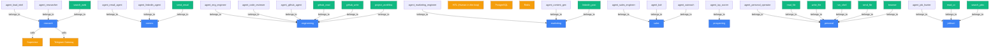

# FounderOS Architecture Graph

```mermaid
graph TB
  dept_research["research"]:::dept
  dept_comms["comms"]:::dept
  dept_engineering["engineering"]:::dept
  dept_marketing["marketing"]:::dept
  dept_sales["sales"]:::dept
  dept_prospecting["prospecting"]:::dept
  dept_personal["personal"]:::dept
  dept_jobhunt["jobhunt"]:::dept
  tool_search_web["search_web"]:::tool
  tool_send_email["send_email"]:::tool
  tool_linkedin_post["linkedin_post"]:::tool
  tool_github_read["github_read"]:::tool
  tool_github_write["github_write"]:::tool
  tool_read_file["read_file"]:::tool
  tool_write_file["write_file"]:::tool
  tool_run_shell["run_shell"]:::tool
  tool_send_file["send_file"]:::tool
  tool_browser["browser"]:::tool
  tool_read_cv["read_cv"]:::tool
  tool_search_jobs["search_jobs"]:::tool
  tool_project_workflow["project_workflow"]:::tool
  service_supervisor["Supervisor"]:::service
  service_telegam["Telegram Gateway"]:::service
  service_hitl["HITL (Human-in-the-loop)"]:::service
  service_postgres["PostgreSQL"]:::service
  service_redis["Redis"]:::service
  agent_lead_intel -->|belongs_to| dept_research
  agent_researcher -->|belongs_to| dept_research
  agent_email_agent -->|belongs_to| dept_comms
  agent_linkedin_agent -->|belongs_to| dept_comms
  agent_eng_engineer -->|belongs_to| dept_engineering
  agent_code_reviewer -->|belongs_to| dept_engineering
  agent_github_agent -->|belongs_to| dept_engineering
  agent_marketing_engineer -->|belongs_to| dept_marketing
  agent_content_gen -->|belongs_to| dept_marketing
  agent_sales_engineer -->|belongs_to| dept_sales
  agent_bdr -->|belongs_to| dept_sales
  agent_outreach -->|belongs_to| dept_sales
  agent_icp_scorer -->|belongs_to| dept_prospecting
  agent_personal_operator -->|belongs_to| dept_personal
  agent_job_hunter -->|belongs_to| dept_jobhunt
  tool_search_web -->|belongs_to| dept_research
  tool_send_email -->|belongs_to| dept_comms
  tool_linkedin_post -->|belongs_to| dept_marketing
  tool_github_read -->|belongs_to| dept_engineering
  tool_github_write -->|belongs_to| dept_engineering
  tool_read_file -->|belongs_to| dept_personal
  tool_write_file -->|belongs_to| dept_personal
  tool_run_shell -->|belongs_to| dept_personal
  tool_send_file -->|belongs_to| dept_personal
  tool_browser -->|belongs_to| dept_personal
  tool_read_cv -->|belongs_to| dept_jobhunt
  tool_search_jobs -->|belongs_to| dept_jobhunt
  tool_project_workflow -->|belongs_to| dept_engineering
  dept_research -->|calls| service_supervisor
  dept_research -->|calls| service_telegam

  classDef dept fill:#3b82f6,stroke:#1e40af,color:#fff
  classDef tool fill:#10b981,stroke:#065f46,color:#fff
  classDef service fill:#f59e0b,stroke:#b45309,color:#fff
```
