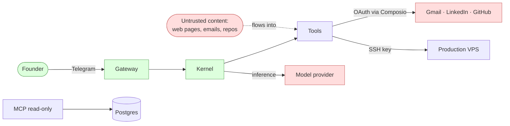

# FounderOS — Threat Model

FounderOS is an autonomous agent that performs privileged, real-world actions on
behalf of a founder. That makes it a higher-risk class of software than a typical
chatbot. This document names the assets, trust boundaries, attack surfaces, and
mitigations so the risk is explicit and reviewable. It complements
[SECURITY.md](../SECURITY.md).

> Scope: the FounderOS kernel + gateway + tools running on the production VPS,
> single-tenant (one founder). Not in scope: the security of third-party
> providers themselves (Gemini, Composio, GitHub) beyond how we integrate them.

## Assets (what an attacker would want)

| Asset | Why it matters |
|-------|----------------|
| Founder credentials / OAuth tokens | Gmail, LinkedIn, GitHub access (via Composio) |
| The production VPS | Full root; the bot runs here and can `vps_run` |
| Founder-private data | CV, personal RAG, conversation history |
| Business data | Turicks brain (strategy, ADRs), lead pipeline |
| The ability to *act* | Send email / post / push / deploy as the founder |
| Model API keys + budget | Cost abuse |

## Trust boundaries

- **Trusted:** the founder (sole principal), the kernel and gateway code.
- **Semi-trusted:** the model provider (we send it task context; it can be wrong
  or manipulated but not our adversary).
- **Untrusted:** all content the agent *reads* — web pages, inbound emails,
  repository contents, search results. This is the primary injection vector.

## Attack surfaces & mitigations

| # | Threat | Vector | Mitigation |
|---|--------|--------|------------|
| T1 | **Prompt injection → unauthorized action** | Malicious text in a scraped page / email tells the agent to email or push something | **HITL on all 17 write tools** — the founder sees and approves the concrete action; injection cannot auto-execute. Workers are envelope-isolated, limiting what injected context can reach. |
| T2 | **Hallucinated / fabricated action** | Model claims it sent/posted when it didn't | **Receipt requirement** — action steps need a code-recorded `ok` receipt or they fail. |
| T3 | **Path traversal / secret exfiltration** | `read_file`/`run_shell` coaxed into reading `.ssh`, `.env`, `/etc` | **Path-guard** — `$HOME`-confined, secret paths blocked even on read. `run_shell` is HITL-gated. |
| T4 | **Duplicate / replayed side effects** | Retry, crash-resume, or repeated approval | **Idempotency key** checked before every send; `action_log` written only on real success. |
| T5 | **Secret exposure** | Hardcoded keys, secrets in logs | Env-only secrets; boot-time validation; PII/secret scrubbing in tracing; `.env` git-ignored. |
| T6 | **Over-broad blast radius** | One compromised worker touches everything | **Least privilege** — per-worker tool sets; `personal` (shell/file) isolated from business workers; no cross-store writes (turicks-brain ⇎ personal-rag). |
| T7 | **Cost / resource abuse** | Loop or injection drives spend | **Budget caps** (run + daily); **step/plan caps** (`≤6` calls/step, `≤8` steps); loops terminate as typed failures. |
| T8 | **State corruption / lost work** | A "recovery" path edits or wipes durable state | Append-only `action_log`; threads wiped **only** by explicit `/reset`; no post-hoc checkpoint rewriting (a v2 tombstone). |
| T9 | **VPS compromise** | `vps_run` / SSH abuse | `vps_run` is HITL-gated and config-gated; SSH is key-based, password auth disabled; privileged ops are auditable. |
| T10 | **Supply chain** | Malicious dependency | Pinned deps; recommend Dependabot + code scanning (see SECURITY.md). |

## Residual risks (honest)

- **Prompt injection is mitigated, not eliminated.** HITL is the backstop: an
  injected instruction still surfaces as an approval card, and a founder who
  approves blindly can be socially engineered. Approval fatigue is a real risk;
  the mitigation is keeping cards specific and legible.
- **The model provider sees task context.** We send temperature-0 requests with
  scrubbed tracing, but content shared with the provider leaves our boundary.
- **Single principal, single instance.** There is no multi-tenant isolation
  because there is one tenant; a SaaS pivot would require revisiting T6 and adding
  per-tenant boundaries.

## Change triggers

Re-review this model when: adding a new write/action tool, changing the HITL gate
list, adding a new external integration, or moving toward multi-tenant.
