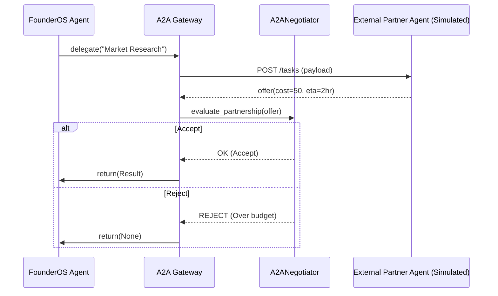

# `a2a_gateway.py` — Sovereign Protocol Ref
**Version:** 8.0 (Sovereign Negotiation)

## 1. Description
The A2A Gateway implements Google's open protocol for **Agent-to-Agent** interoperability. It allows FounderOS agents to discover, delegate to, and negotiate with 3rd-party external agents across vendors.

## 2. Core V8 Elements
- **AgentCard**: The public JSON manifest defining FounderOS capabilities.
- **A2ANegotiator**: The V8 logic layer for autonomous haggling over cost/ETA.
- **PartnerAgentSimulator**: An internal V8 testing harness to simulate external agents.

## 3. Key Functions
1. `delegate_task()`: Discovers a capable agent and sends a JSON-RPC request.
2. `evaluate_partnership()`: Evaluates external agent offers against budget limits.
3. `get_founderos_card_json()`: Exposes the system's "Business Card" to the A2A marketplace.

## 4. Mermaid Flowchart

