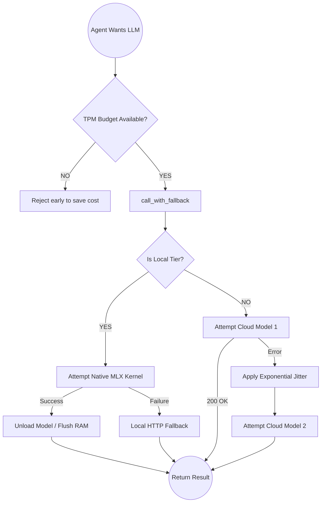

# `config.py` — Component Reference

## 1. Description
`config.py` houses the economic, circuit-breaking, and resilient structural logic of FounderOS. It contains the Model Cascaded routing dictionary ensuring the system remains highly available regardless of downstream API outages.

## 2. Core Elements
- `TIER_0` to `TIER_5` constant mappings.
- `TPM_LIMITS`: Hardcoded tokens-per-minute array governing model allocations per provider.

## 3. Key Functions / V8 Features
1. **MLX Native Core (V8 Optimization)**: Optimizes local execution for Apple M4. `load_model()` uses 4-bit quantization to fit within 16GB RAM.
2. **VRAM Flushing**: `unload_model()` flushes weights from Unified Memory to prevent system swap overhead during background swarms.
3. **High-Reasoning Cascades**: Integration of `o3-mini-high` for logical "Sovereign" decision making.
4. `call_with_fallback()`: Central router that prioritizes Native Kernels before cloud providers.

## 4. Mermaid Flowchart

