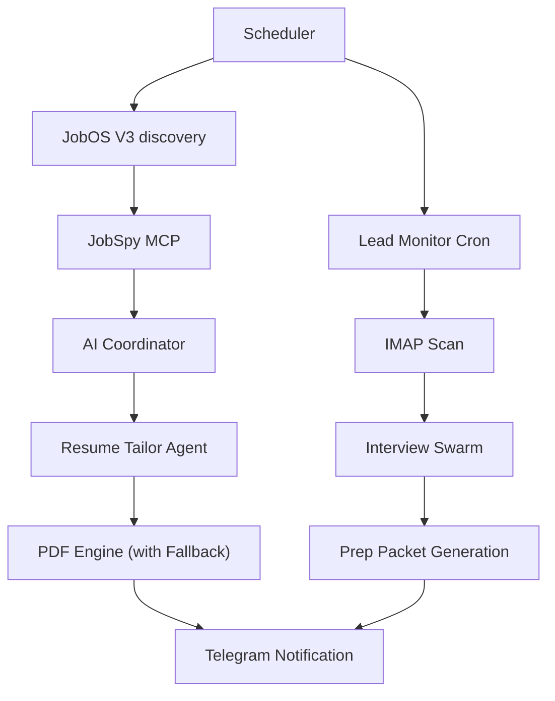

# JobOS V3 Documentation — Career Intelligence Engine

## Overview
JobOS V3 is an autonomous, multi-agent swarm designed to handle the entire career growth lifecycle—from discovery to interview preparation. It replaces brittle web scraping with structured MCP-based research and high-fidelity asset generation.

## Core Components

### 1. Discovery & Search (`job_search_os.py`)
- **Phase 1: Unified Search**: Uses the `jobspy_mcp` server to look across LinkedIn, YC, Wellfound, and X simultaneously.
- **Phase 2: Coordinator**: Scores leads against your **ICP** and historical context retrieved from **ChromaDB**.

### 2. Asset Tailoring Engine
- **Resume Tailor (`resume_modifier.py`)**: Uses your `master_resume.md` to select and rewrite metrics/bullets for each specific job description.
- **PDF Engine (`pdf_engine.py`)**: Converts tailored Markdown into premium, ATS-friendly PDFs. 
    - **Stability**: Includes a **V7 Pure-Python Fallback** (`pdf_engine_fallback.py`) that activates if system-level dependencies (`libgobject`) are missing, ensuring 100% execution reliability on new hardware.

### 3. Funnel Management
- **Lead Monitor (`lead_tracker.py`)**: A background cron job that scans your configured IMAP mailbox for interview invites or application updates.
- **Interview Swarm (`interview_swarm.py`)**: Automatically research companies and personnel for any new interview lead, delivering a prep guide to Telegram.

## Setup & Configuration

### 1. Environment Variables (.env)
```bash
# IMAP for Lead Tracking
IMAP_SERVER="imap.gmail.com"
IMAP_USER="your-email@gmail.com"
IMAP_PASS="your-app-password"

# Telegram Topic
TOPIC_JOB_OS=12345
```

### 2. Master Resume
Update `/Users/pushkarverma/FounderOS/master_resume.md` with all your achievements. The more data you provide, the better the tailoring engine performs.

## Architecture Diagram

