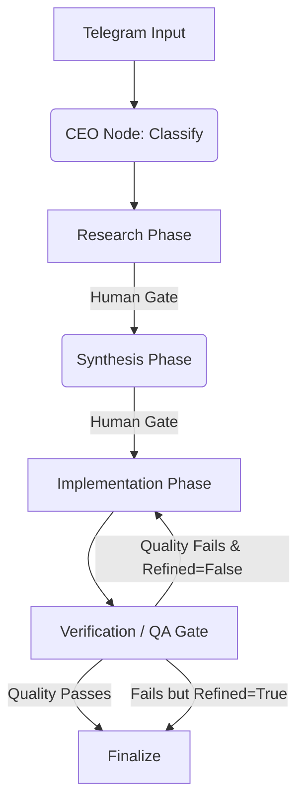

# `orchestrator.py` — Component Reference

## 1. Description
The `orchestrator.py` module contains the central execution loop for the FounderOS multi-agent system. It strictly enforces the 4-Phase Coordinator lifecycle with a new Hard Gate validation checkpoint.

## 2. Core Elements
- `FounderState`: A `TypedDict` defining the persistent state through the LangGraph cycle (handling tracking of current data, LLM critiques, and boolean approvals).
- `build_graph()`: Constructs the `StateGraph` and compiles the DAG into an executable entity.

## 3. Execution Nodes
1. `ceo_node`: Initiates the flow by parsing JSON constraints from the user message.
2. `research_node`: Evaluates the state and delegates asynchronous background scraping/MCP calls.
3. `synthesis_node`: Reads the scratchpad and unifies the data into an actionable Implementation Spec.
4. `implementation_node`: Core execution unit representing a specialized worker carrying out the spec.
5. `verification_node`: The **Hard Gate**. Evaluates output quality and loops backward exactly once upon failure.

## 4. Mermaid Flowchart

