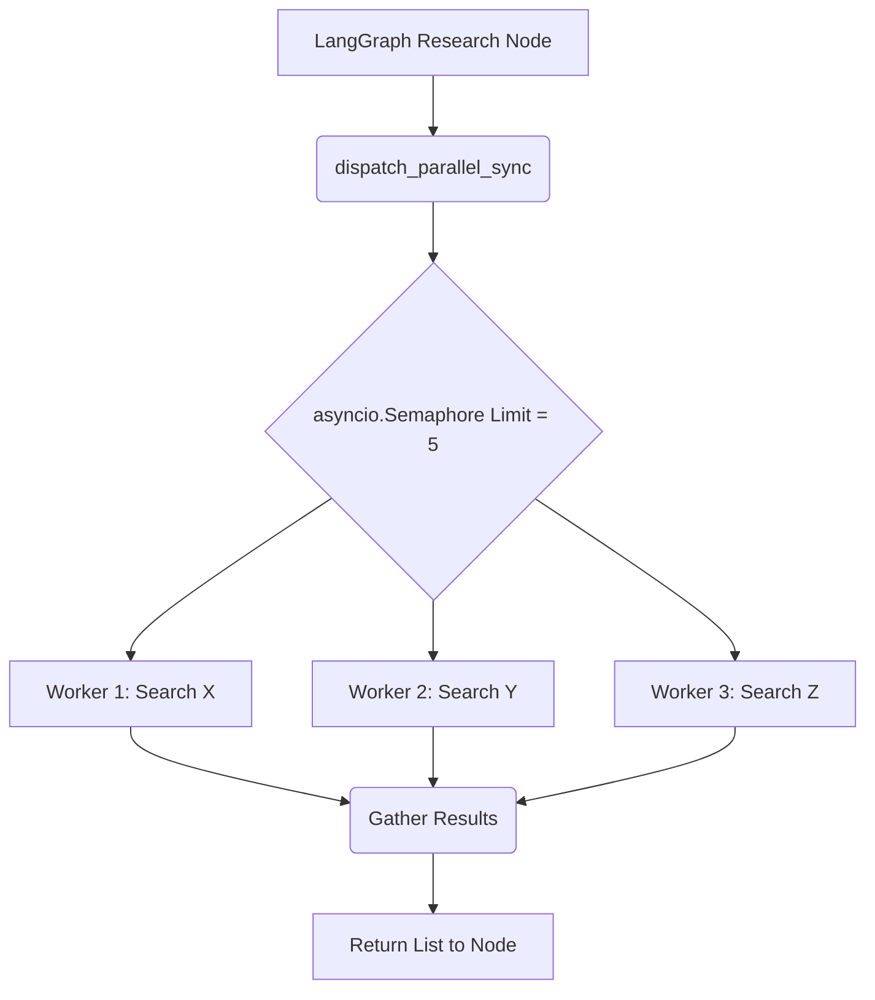

# `parallel_dispatch.py` — Component Reference

## 1. Description
The `parallel_dispatch.py` module enforces the "Claude Code" pattern of scattering read-only agents and gathering them simultaneously to save execution time.

## 2. Core Elements
- `WorkerTask`: Dataclass summarizing the ID, Tier, and prompt of an individual worker.
- `WorkerResult`: Dataclass containing the outcome payload.

## 3. Key Functions
1. `dispatch_parallel()`: Async core utilizing Python `asyncio.Semaphore(max_workers=5)` to prevent LLM endpoint rate limits from shattering when 50 requests launch instantly.
2. `dispatch_parallel_sync()`: Blocking wrapper utilizing `asyncio.run` so the LangGraph state machine isn't forced to await the entire thread structure manually.

## 4. Mermaid Flowchart

