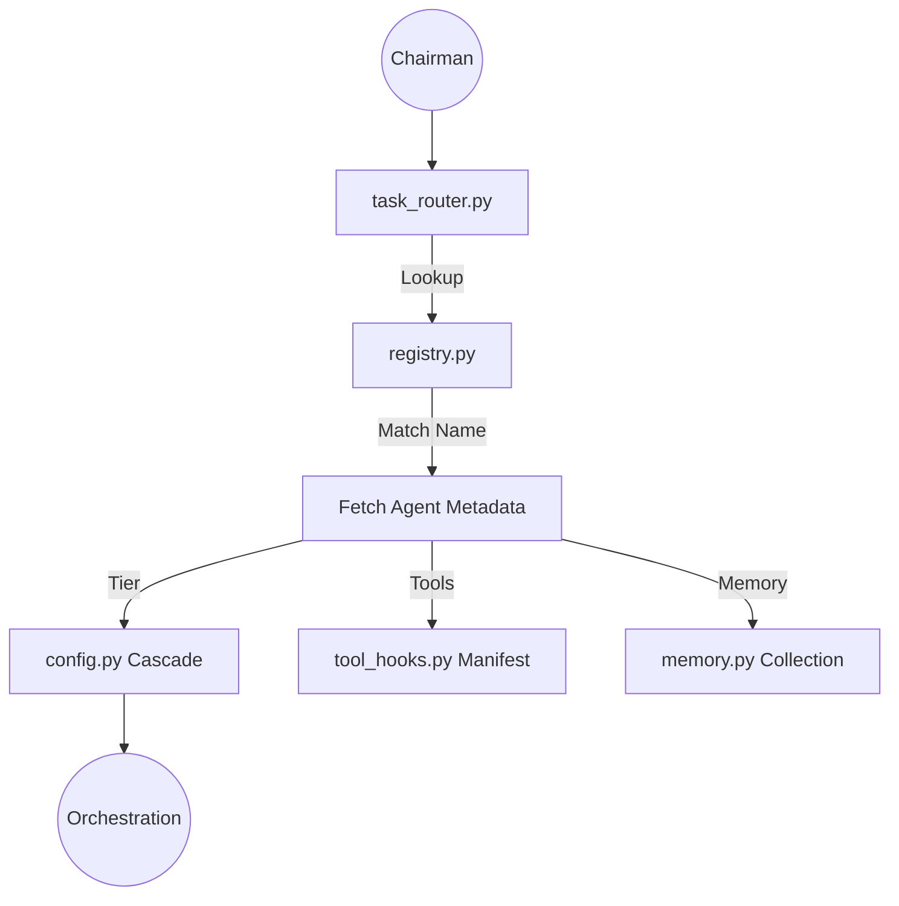

# `registry.py` — Central Agent Mapping Ref
**Version:** 8.0 (V8 Transition)

## 1. Description
The Central Registry is the "Soul of the Machine." It maps every one of the 27 agents in the FounderOS ecosystem to their respective security silos, memory volumes, and cascade tiers.

## 2. Core Elements
- `Agent` Dataclass: Defines `name`, `company`, `tier`, `memories`, and `tools`.
- `_AGENTS_DB`: The definitive list of all 27 active agent instances.

## 3. V8 Sovereign Tiering
In V8, high-stakes agents have been migrated to the `code` cascade (o3-mini-high) to close the intelligence gap with Claude Code while maintaining M4-native worker swarms for high-volume tasks.

### Tier Mapping Policy:
- **`code` (o3-mini)**: `bidding_sniper`, `senior_dev`, `job_intel`.
- **`ceo` (Claude 4.5/Sonnet)**: `scrum_pm`, `coordinator`.
- **`local` (Qwen 2.5 4-bit)**: `research_worker`, `qa_tester`, `vibe_designer`.

## 4. Mermaid Flowchart

