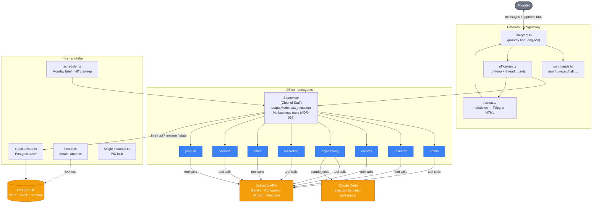

# 01 — System Architecture

The moving parts and how they connect. Everything below the gateway runs
in-process in a single Node.js service; Postgres and the Claude Code executor
are the only out-of-process dependencies on the hot path.

**Key facts**
- The office graph is compiled **once** (`getOffice()` singleton) with the Postgres
  checkpointer — never per request.
- 8 departments: admin · research · comms · engineering · marketing · sales · personal · jobhunt.
- Supervisor has **no tools** (ADR-028). Business context and memory live in the `admin` dept.
- `outputMode: "last_message"` is pinned + asserted at boot (ADR-021 context isolation).
- One model for the whole office: `gemini-2.5-flash` via OpenRouter (temp 0), 503 fallback chain.
- The gateway is the only layer that talks to Telegram; agents that need to push a
  file use the api-only `infra/telegram-send.ts` client (no second long-poll → no 409).
- FounderOS also **exposes** an MCP server on `localhost:3100` (search_web, read_context,
  search_knowledge, search_memory, read_cv, github_read) for external MCP clients.
