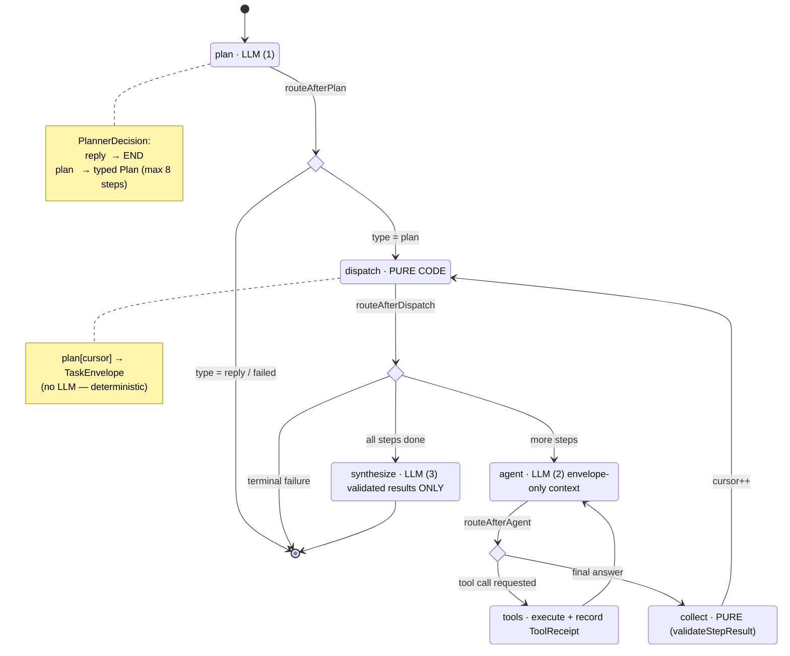

# 02 — Orchestration Path (the kernel StateGraph)

One message, end to end. This is the entire control flow — assembled in
[`src/kernel/graph.ts`](../../src/kernel/graph.ts) as a LangGraph `StateGraph`.
There is exactly one path. No pre-router, no post-hoc guard, no fast-path
bypass (all three are CI tombstones).

## Node semantics

| Node | Kind | Job | Cannot |
|------|------|-----|--------|
| **plan** | LLM | Turn the message into a `PlannerDecision` — a direct reply or a typed, ≤8-step `Plan`. Replays prior-turn summaries for follow-ups. | Route by regex; mutate the task |
| **dispatch** | pure | Hand `plan[cursor]` to a worker as a validated `TaskEnvelope`. | Call a model; "decide" anything probabilistically |
| **agent** | LLM | Execute one step with **only its envelope** as context and a capped tool set. | See the chat history or other steps |
| **tools** | code | Run the tool, record a code-authored `ToolReceipt`, pause at `interrupt()` if HITL-gated. | Let the model write the receipt |
| **collect** | pure | Validate the `StepResult` against the envelope's `expected.schema_ref`. | Accept an action claim with no receipt |
| **synthesize** | LLM | Write the founder-facing reply from **validated results only**. | See or invent unvalidated data |

## Mission status, as it moves

`planning → executing → awaiting_approval → synthesizing → done`
(or `→ failed` at any stage, with a typed `FailureReport`).

Loop safety is structural, not heuristic: a step is capped at `MAX_TOOL_CALLS_PER_STEP = 6`, a plan at `MAX_PLAN_STEPS = 8`. A runaway worker terminates as a typed failure — the thread is **never** wiped (contrast: the v2 `GraphRecursionError` → `clearThreadAfterAbort()` path that deleted the founder's conversation).

Data-flow detail: [04 — Contract data flow](04-contract-dataflow.md). Approval detail: [03 — HITL flow](03-hitl-flow.md).
