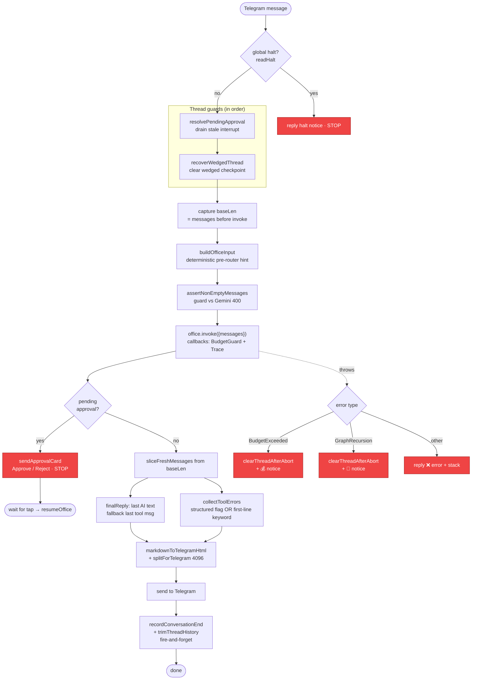

# 02 — Request Lifecycle

What happens to **one** Telegram message, end to end. This is `runOfficeText()`
in [`src/gateway/office-run.ts`](../../src/gateway/office-run.ts). Read it with
[08 — Thread state machine](08-thread-state-machine.md) for the guard logic.

**Why each step exists (the bugs they fix)**
- **baseLen + sliceFreshMessages** — the Postgres checkpointer returns the *whole*
  thread trail every call. Without slicing, stale AI answers and old tool errors
  resurface every turn ("identical stale reply", "persistent toolErrors:1").
- **collectToolErrors** — tools return errors as their *result string* (they don't
  throw), so they never hit the catch. We surface them so the founder always sees a
  real failure. The two-signal test (structured `success:false` OR error keyword on
  the **first line**) avoids false "⚠️ Tool issue" on content that merely mentions
  the word "fail".
- **clearThreadAfterAbort** — an abort leaves the thread parked mid-graph; clearing
  unconditionally (same as `/reset`) stops the next message re-entering the dead loop.
