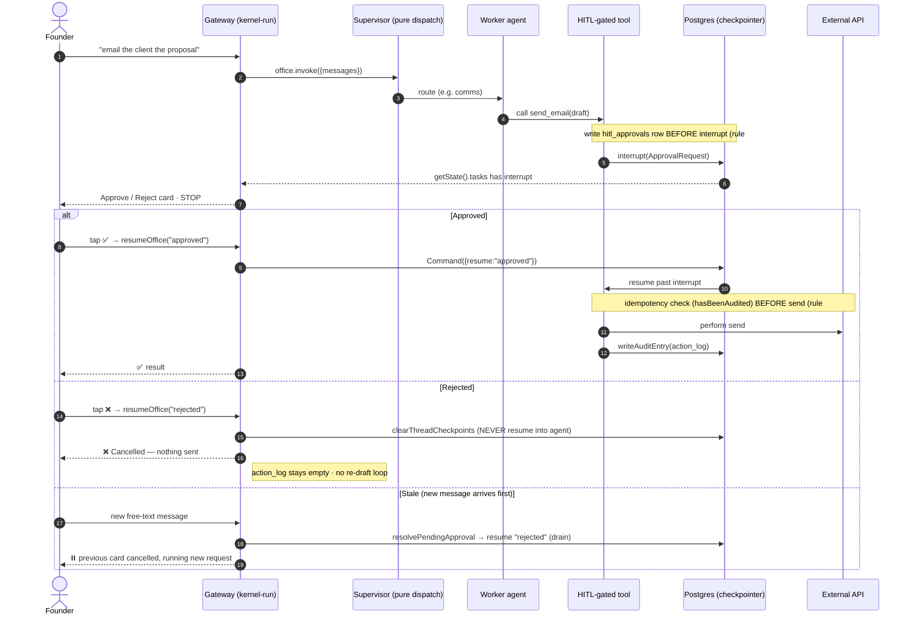

# 03 — HITL Approval Flow

How founder approval gates every external action. HITL = native LangGraph
`interrupt()`, DB-backed and **crash-safe**: because graph state lives in the
Postgres checkpointer, a pending approval survives a process restart.

The cardinal rule: **the side effect runs only after an `approved` resume.** A
rejection — or a crash, or a stale card — is always a clean no-op.

**HITL-gated tools** (`HITL_GATED_TOOLS` in
[`capabilities.ts`](../../src/agents/capabilities.ts)) — every one pauses before acting:

`send_email` · `linkedin_post` · `github_write` · `write_file` · `run_shell` ·
`browser` · `send_file` · `claude_code` · `project_workflow` ·
`create_calendar_event` · `record_event`

**Why reject clears the thread:** a ReAct sub-agent treats the rejection
tool-result as feedback and re-drafts, firing `interrupt()` again forever (live
repro 2026-06-12). So reject is terminal: clear + confirm, never resume into the agent.
