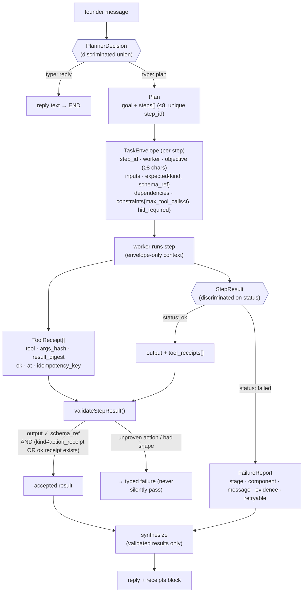

# 04 — Contract Data Flow (the task as a typed object)

In v2 the task was a sentence smuggled through a prompt and a trimmed history.
In v3 the task is a **typed object at every boundary**, defined in
[`src/kernel/contracts.ts`](../../src/kernel/contracts.ts) and Zod-validated on
the way in and out of every node. This diagram follows one task's data through
those types.

## The contracts

| Type | Purpose | Key fields |
|------|---------|-----------|
| `PlannerDecision` | Reply-or-plan, decided once | `reply` \| `plan` |
| `Plan` | Ordered work | `goal`, `steps[]` (unique ids, ≤8) |
| `TaskEnvelope` | **The only thing a worker sees** | `objective`, `inputs`, `expected`, `constraints` |
| `ToolReceipt` | Code-recorded proof of a tool run | `args_hash`, `result_digest`, `ok`, `idempotency_key` |
| `StepResult` | Typed outcome | `ok{output, receipts}` \| `failed{failure}` |
| `FailureReport` | Honest failure | `stage`, `component`, `evidence`, `retryable` |

## The output contract

Each envelope names an `expected.schema_ref` (`text.summary`, `research.findings`, `draft.email`, `draft.linkedin_post`, `action.summary`, `data.generic`, or a `signal.*`). `validateStepResult()` parses the worker's output against that exact Zod schema. If `expected.kind === "action_receipt"`, the result **must** carry a successful `ToolReceipt` — an action claim without one is rejected as unproven. That single rule is the zero-hallucination guarantee. See [07 — Receipts & zero-hallucination](07-receipt-and-zero-hallucination.md).
