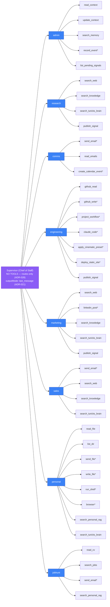

# 04 — Department & Tool Map

Which department owns which tool, and what's gated. This is the single source of
truth [`src/agents/capabilities.ts`](../../src/agents/capabilities.ts) drawn out.
**A tool has exactly one owner department** — that's what keeps routing
collision-free. `*` = pauses for founder approval (HITL).

**Ownership notes (why a tool lives where it does)**
- **Supervisor has NO tools** (ADR-028: Chief of Staff routes only). Business context,
  memory, and signal visibility all live in the `admin` department.
- `search_web` / `search_knowledge` / `search_turicks_brain` are **shared read tools** —
  they appear in several departments because they're cheap, stateless reads with no
  collision risk. Every *write/send* tool has a single owner.
- `admin` owns `read_context`, `update_context`, `search_memory`, `record_event`, and
  `list_pending_signals` — all internal coordination, no external side effects.
- `linkedin_post` lives in **marketing only** (was in comms — routing collision removed).
- `read_emails` lives in **comms only** (was in research — inbox data stays in its dept).
- `send_email` appears in comms, sales, and jobhunt — each uses `createSendEmailTool("dept")`
  which scopes the idempotency key and audit log per department.
- `search_personal_rag` → **personal + jobhunt only** — career data is founder-private.
  Not available to research, sales, or marketing (ADR-013/015).
- **prospecting was merged into research** — ICP scoring is a research *mode*, no unique tool.
- `claude_code` is engineering's primary executor: a full Claude Code coding agent
  (files, shell, git, gh) in an isolated workspace.
- `browser` is Safari automation on the founder's Mac (personal dept, path-guarded).
- `publish_signal` in research/marketing/engineering: internal coordination write to
  `dept_signals` table — not HITL-gated (no external side effect, ADR-024).

**Adding a tool touches 6 layers** (see [`docs/rules/PROGRAMMING-RULES.md`](../rules/PROGRAMMING-RULES.md)):
`src/tools/{name}.ts` → test → `agent-tools/{dept}.ts` wrapper → `agent-tools.ts`
barrel → `capabilities.ts` (DEPARTMENT_TOOLS array) → `system-prompts.ts`.
The supervisor's capability manifest auto-regenerates from `capabilities.ts` — no
hand-maintained prompt prose that can drift from reality.
