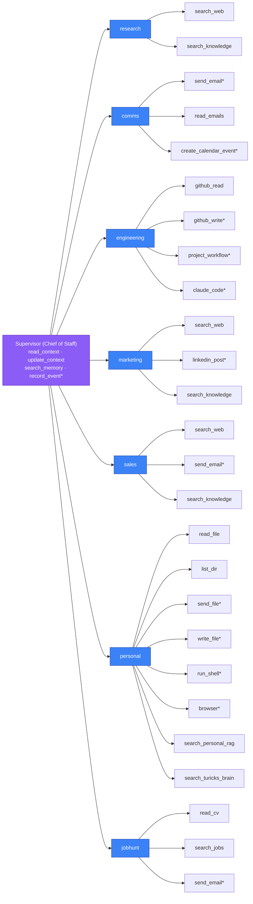

# 04 — Department & Tool Map

Which department owns which tool, and what's gated. This is the single source of
truth [`src/agents/capabilities.ts`](../../src/agents/capabilities.ts) drawn out.
**A tool has exactly one owner department** — that's what keeps routing
collision-free. `*` = pauses for founder approval (HITL).

**Ownership notes (why a tool lives where it does)**
- `search_web` / `search_knowledge` are **shared read tools** — they appear in
  several departments because they're cheap, stateless reads with no collision risk.
  Every *write/send* tool has a single owner.
- `linkedin_post` lives in **marketing only** (was duplicated in comms — removed).
- `read_emails` lives in **comms only** (was duplicated in research — removed).
- **prospecting was merged into research** — ICP scoring is a research *mode*, it
  carried no unique tool. (The auto-generated `.claude/graph-mermaid.md` still shows
  the old 8th department; this hand-authored map is current.)
- `claude_code` is engineering's primary executor: a full Claude Code coding agent
  (files, shell, git, gh) in an isolated workspace.
- `browser` is Safari automation on the founder's Mac (personal dept).

**Adding a tool touches 6 layers** (see [`docs/rules/PROGRAMMING-RULES.md`](../rules/PROGRAMMING-RULES.md)):
`src/tools/{name}.ts` → test → `agent-tools/{dept}.ts` wrapper → `agent-tools.ts`
barrel → `capabilities.ts` (department array + HITL set) → `system-prompts.ts`.
Because `capabilities.ts` is the single source, the supervisor's capability
manifest auto-regenerates — no prompt prose to hand-sync.
