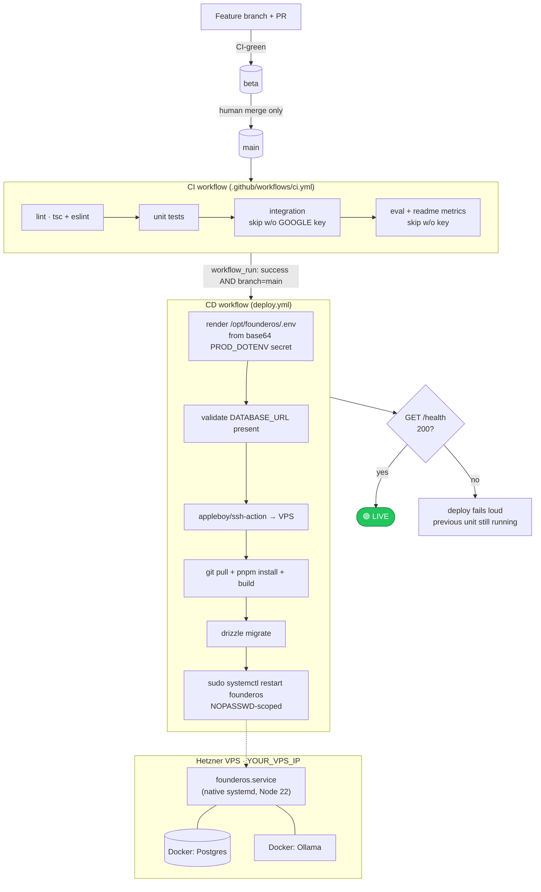

# 05 — Deployment Pipeline

How a commit reaches production. Promotion is **two-stage** (work branch → `beta`
→ `main`, ADR-045; the former `stable` tier was retired). **`main` IS production** —
only humans merge to it, and every merge auto-deploys to the Hetzner VPS after CI
passes. Full runbook + Day-1 gotchas: [`docs/guides/DEPLOYMENT.md`](../guides/DEPLOYMENT.md).

**Hard-won facts**
- CI gating must happen at the **step** level via `env`, not a job-level `if:` —
  `secrets.*` in a job-level `if:` silently invalidates the whole workflow (0s pass).
- The box `.env` + the `PROD_DOTENV` GitHub secret are the **single source of truth**
  for prod env. **Never re-push the local Mac `.env.production`** — it has a stale DB
  password and would overwrite working prod values. Refresh the Mac copy *from* the box.
- Postgres + Ollama run as Docker containers; the app itself runs **native** under
  systemd (not containerized) so deploys are a fast `git pull` + restart.
- Deploy key `~/.ssh/founderos_deploy`; SSH `founderos@YOUR_VPS_IP:22`; the deploy
  user's only NOPASSWD sudo right is `systemctl restart founderos`.
