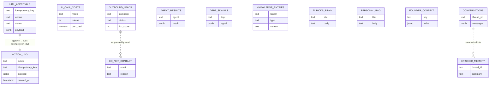

# 06 — Data Model

What Postgres stores and why. The tables in
[`src/db/schema.ts`](../../src/db/schema.ts) live in two Postgres schemas —
**`agents`** (operational state) and **`brain`** (knowledge / RAG) — grouped below
by the job they do. All durable state is Postgres (Redis is SaaS-phase, not on the
hot path). Reads/writes go through named functions in
[`src/db/queries.ts`](../../src/db/queries.ts) — never raw SQL elsewhere. The ER
diagram shows the core relationships; the group table lists the full set.

**The jobs the tables do**

| Group | Schema | Tables | Purpose |
|-------|--------|--------|---------|
| **Safety / audit** | `agents` | `hitl_approvals`, `action_log`, `ai_call_costs` | HITL recoverability, idempotency before every send, cost tracking |
| **Pipeline** | `agents` | `outbound_leads`, `do_not_contact`, `agent_results`, `dept_signals` | Lead state, GDPR/CAN-SPAM suppression, per-agent outputs, cross-worker signals |
| **Scheduling / assets** | `agents` | `scheduled_posts`, `scheduled_tasks`, `agent_assets`, `saved_workflows`, `gap_scans` | Queued posts, cron-fired kernel turns, generated assets, the reusable-script catalog (`run_count` = "most used"), AI-visibility scans |
| **Ops / accounts** | `agents` | `missions`, `integration_accounts`, `founder_context`, `failure_lessons` | Mission records, per-account OAuth registry, persistent founder context, failure-lesson memory (accelerates the planner) |
| **Knowledge (RAG)** | `brain` | `knowledge_entries`, `turicks_brain`, `personal_rag`, `research_cache` | Business + career knowledge + research cache. **Boundary (ADR-013/015): turicks-brain and personal-rag are separate stores — never cross-write.** |
| **Memory** | `agents` | `conversations`, `episodic_memory` | Durable conversation history + "what did we decide about X?" recall |

**Key invariants**
- `hitl_approvals` is written **before** `interrupt()` (rule #4) → crash-safe.
- `action_log` is written **after** the external action with the same `idempotency_key`
  (rule #5) → a re-run finds the audit row and skips the duplicate send.
- The LangGraph **checkpointer** uses its own tables (managed by `PostgresSaver`),
  separate from these app tables — that's the per-thread graph state, cleared by
  `/reset` and `clearThreadCheckpoints`.
