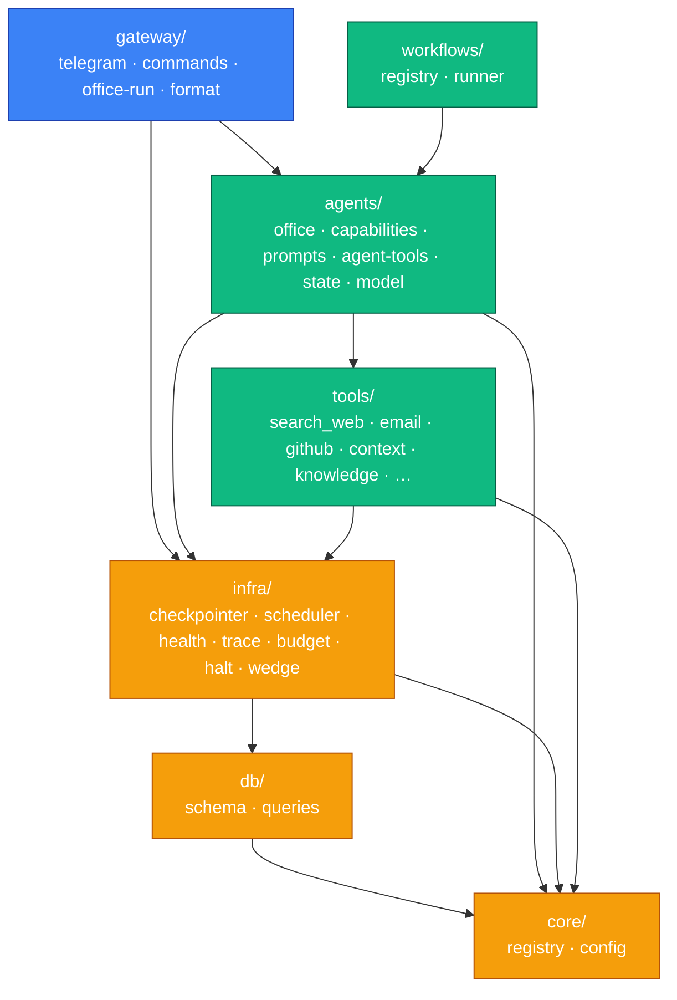

# 07 — Module Layering

What can import what. FounderOS enforces a strict one-directional dependency rule
(CLAUDE.md "Module & Import Rules"). Arrows point in the **only** allowed direction;
anything against an arrow is a circular import and is banned.

**The rule, stated plainly:** `core → db → infra → agents → gateway`. Lower layers
never import upward.

**Two patterns that exist to *preserve* this rule**
- **`agent-tools.ts` is a barrel.** The real tool wrappers live in per-department
  modules under `agent-tools/` (hitl, research, comms, engineering, personal,
  jobhunt, memory); the barrel just re-exports them so `office.ts` and
  `capabilities.ts` have one import surface.
- **`infra/telegram-send.ts` is api-only.** Agents sometimes need to push a file to
  Telegram, but agents can't import the gateway (wrong direction) — and a second
  long-poll client would cause a 409. So the *infra* layer holds a send-only grammy
  client (no polling), which agents are allowed to import.

**Why this matters for new developers:** if your import triggers a circular-dependency
error, you're pointing an arrow the wrong way. Move the shared thing **down** a layer
(usually into `infra/` or `core/`), don't import sideways.
