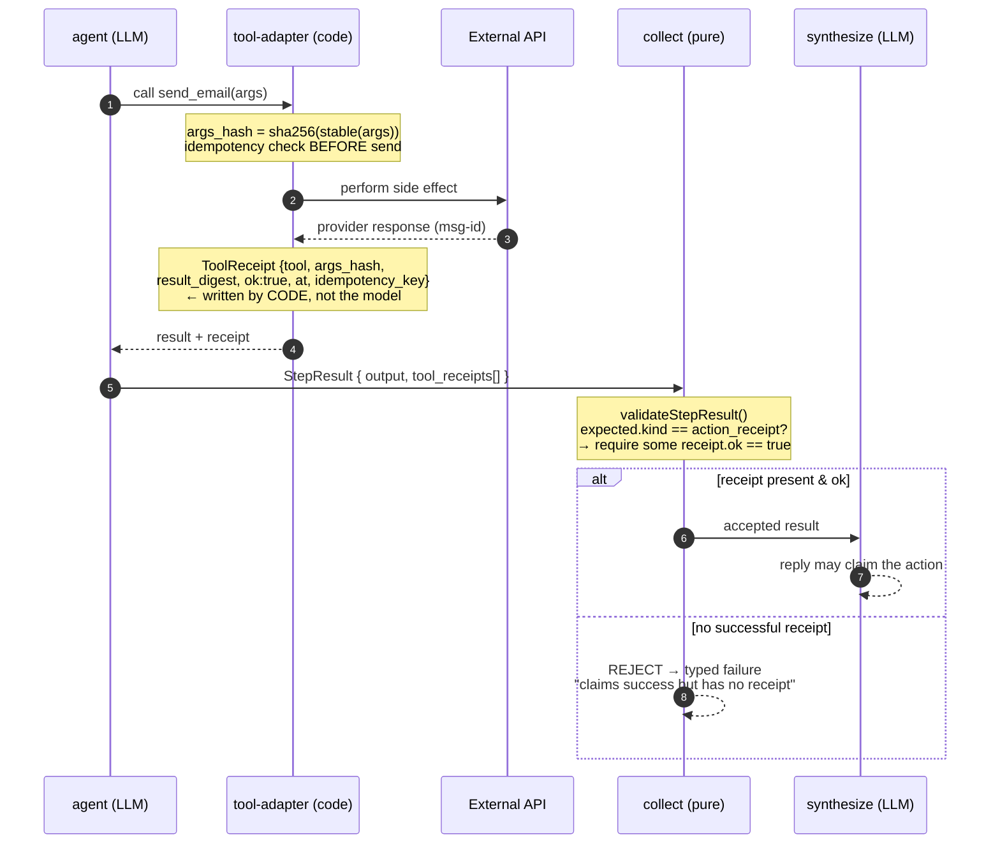

# 07 — Receipts & Zero-Hallucination

The scariest failure mode of an action-taking agent is claiming it did something
it didn't. v3 makes that claim **structurally impossible** rather than trying to
catch it after the fact (the v2 approach — a 591-line, 77-regex "lie detector" —
is a CI tombstone). The mechanism is the `ToolReceipt` plus one check in
`validateStepResult`.

## Why it can't be gamed

- **The model never writes the receipt.** The tool adapter does, from the actual execution. The LLM cannot forge `ok: true`.
- **The synthesizer only sees validated results.** The node that writes "✅ Sent" physically never receives an unbacked action, so it cannot narrate one.
- **Idempotency is upstream of the receipt.** The idempotency key is checked before the side effect, so a retry can't double-send *and* can't mint a second receipt for the same action.
- **It's an executable guarantee, not a promise.** `docs/PROOF.md` lists `kernel-e2e: fabricated action` — a test that a fabricated action claim is rejected — running offline at $0.

## Contrast with v2

| | v2 (detection) | v3 (prevention) |
|---|---|---|
| Mechanism | 77 regexes scanning the reply | 1 receipt check in a pure validator |
| Grows with | every incident (a new pattern each time) | never (written once, inherited by every tool) |
| Failure of the mechanism | false positive → 2× spend, canned refusal, **checkpoint rewritten** | none — the unbacked claim can't reach the writer |
| Truth source | the prose (wrong place) | the execution receipt (right place) |
