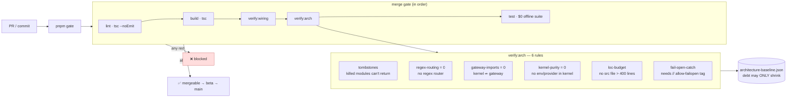

# 08 — Anti-Slop CI Gates

v2 rotted because nothing stopped complexity from creeping back — every incident
added a layer. v3 encodes "stay simple" as **six machine-checked rules** in
[`scripts/verify-architecture.ts`](../../scripts/verify-architecture.ts), run on
every PR via `pnpm gate`. The agent (and the tired human) can't rebuild the slop,
because the build fails.

## The rules

| Rule | What it forbids | Current |
|------|-----------------|---------|
| **tombstones** | Recreating a killed module (`pre-router`, `execution-guard`, `office.ts`, `office-run`, domain subgraphs) | enforced |
| **regex-routing** | Routing a message by regex | `0` ✅ |
| **gateway-imports** | The kernel importing the gateway (wrong direction) | `0` ✅ |
| **kernel-purity** | The kernel reading env or constructing a provider client | `0` ✅ |
| **loc-budget** | Any `src` file over 400 lines (god modules) | enforced |
| **fail-open-catch** | A swallow-and-continue `catch` without an `// allow-failopen: <reason>` tag | ratcheted |

## The ratchet

`governance/architecture-baseline.json` records the known count of each debt. CI compares the PR's count to the baseline: **it may only go down.** You cannot add a new regex router or a new untagged fail-open catch — the counter refuses. Deleting slop is permanent because the gate won't let it grow back.

This is the discipline the [case studies](../turicks-case-studies/) argue for, expressed as code.
