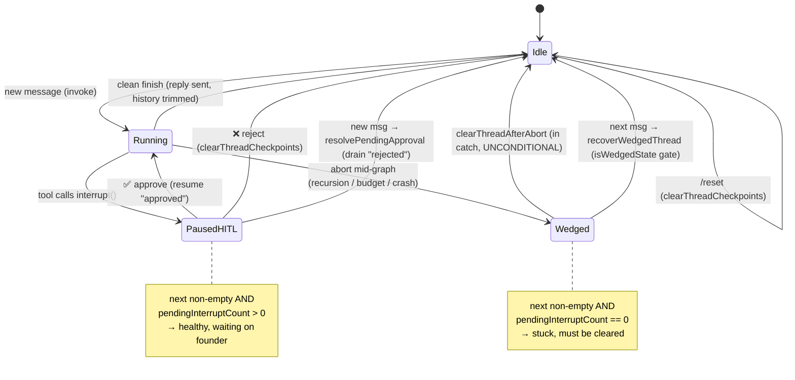

# 08 — Thread State Machine

What states a per-chat thread can be in, and how the guards recover it. Each
Telegram chat maps to one LangGraph thread (`thread_id = TENANT:chatId`) whose
state lives in the Postgres checkpointer. Three states matter; two of them are
*recoverable* failure modes that historically bricked the chat until `/reset`.

**The distinction that took three production bugs to get right**
Both `PausedHITL` and `Wedged` have a *pending node* (`state.next` non-empty). The
**only** thing that tells them apart is the interrupt count
([`isWedgedState`](../../src/infra/wedge.ts)):

| State | `next` | pending interrupts | Meaning | Recovery |
|-------|--------|--------------------|---------|----------|
| Paused (HITL) | non-empty | **> 0** | Waiting on founder approval | Resume on tap |
| Wedged | non-empty | **0** | Aborted run left a stuck node | Clear checkpoint |

**Two recovery paths, defense in depth**
1. **At the abort site** (`clearThreadAfterAbort`) — in the recursion/budget catch
   blocks, clear **unconditionally**. A recursion abort often leaves `next` *empty*
   with the real work parked in `checkpoint_writes`, so the `isWedgedState` gate
   would return false — gating here is wrong, the run is known-dead. (This was the
   P0 fixed 2026-06-14: the gated clear let the checkpoint survive and the next
   message instantly re-hit the limit.)
2. **At the next message** (`recoverWedgedThread`) — belt-and-braces: if a wedge
   somehow survived (e.g. an out-of-process crash that never ran a catch block), the
   next message detects it via `isWedgedState` and clears before invoking.

`recoverWedgedThread` **must** run *after* `resolvePendingApproval`, or a legitimate
HITL pause (also `next` non-empty) would be wiped as a wedge.
