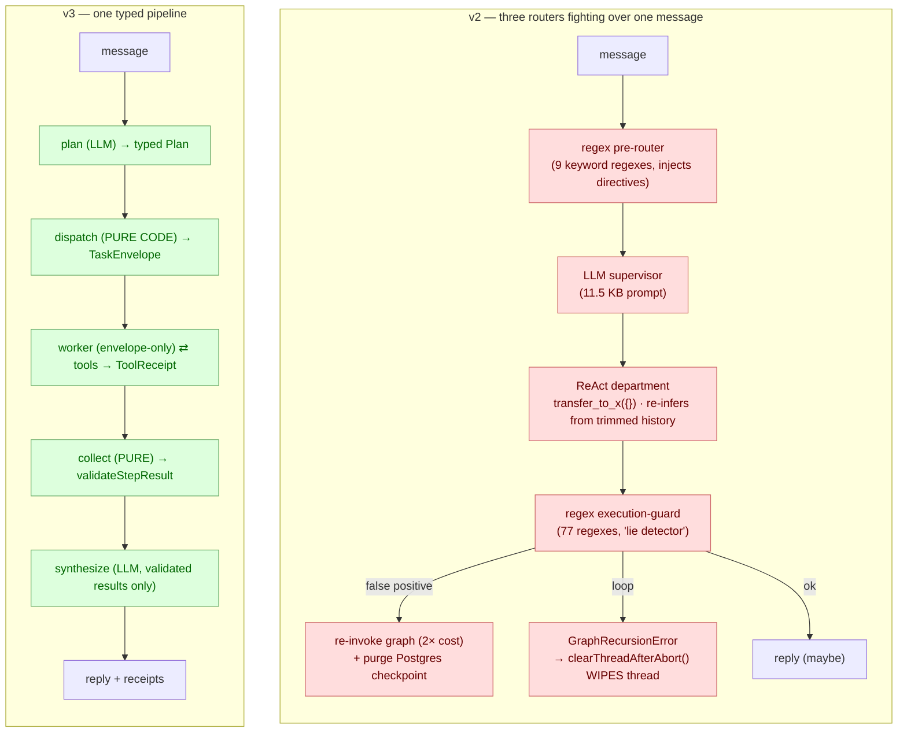

# 09 — v2 vs v3 (the pivot, side by side)

The one-glance version of the whole story. Same product, same goal — two
completely different control philosophies. Left is what we shipped and regretted;
right is what runs today. (Full narrative: [the case studies](../turicks-case-studies/).)

## What changed, in numbers

| Dimension | v2 | v3 |
|-----------|----|----|
| Control systems per message | 3 (2 regex + 1 LLM) | 1 typed pipeline |
| Routing | ~77 regexes + 11.5 KB prompt | pure functions, unit-tested |
| Handoff | `transfer_to_x({})` + trimmed history | validated `TaskEnvelope` |
| Action truth | 77-regex lie detector | code-recorded `ToolReceipt` |
| Failure | swallowed / thread wiped | typed `FailureReport`, thread preserved |
| Add a capability | edit 3 routers + prompt + eval | add a tool to a capability list |
| Complexity guardrail | code-review pleas | 6 CI gates + debt ratchet |
| Dev-loop cost | live calls to iterate | `$0` offline full-graph tests |

## The lesson in one line

> Every v2 layer was added to police the layer inside it, and each new layer made the whole less reliable. v3 has one layer, and CI makes sure it stays that way.
