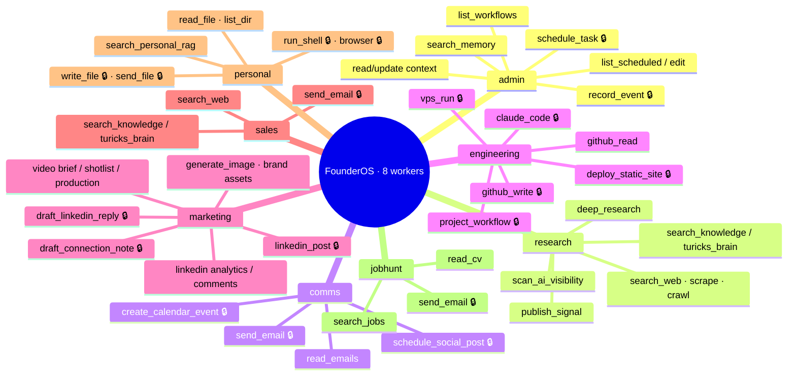

# 10 — Capability Map (workers, tools, HITL)

What FounderOS can actually do, and where the approval gates sit. Tools are
declared once in [`src/agents/capabilities.ts`](../../src/agents/capabilities.ts)
(the single source of truth), so "what can you do?" can never drift from reality.
A 🔒 means the tool pauses for founder approval before it acts (17 gated tools total).

## The gate list (17 HITL-gated tools)

Every tool that sends, writes, spends, or changes external state pauses at an `interrupt()` and shows the founder exactly what it will do:

`send_email` · `linkedin_post` · `schedule_social_post` · `schedule_task` ·
`draft_linkedin_reply` · `draft_connection_note` · `github_write` · `write_file` ·
`run_shell` · `browser` · `send_file` · `claude_code` · `vps_run` ·
`deploy_static_site` · `project_workflow` · `create_calendar_event` · `record_event`

Read-only tools (search, read, list, analytics) run without a gate — they can't cause harm. Approval mechanics: [03 — HITL flow](03-hitl-flow.md). Design rationale (least privilege per worker): the personal worker's file/shell/browser access is deliberately isolated from the business workers.
