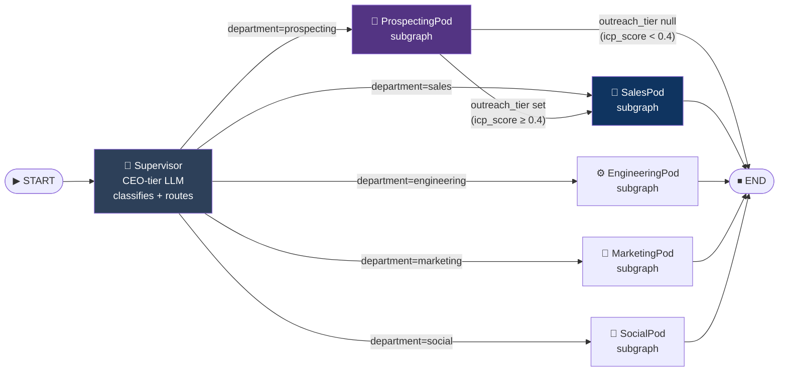
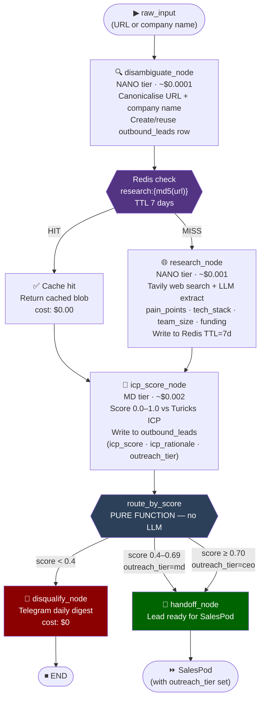
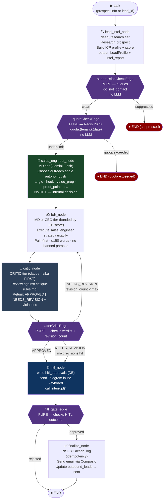
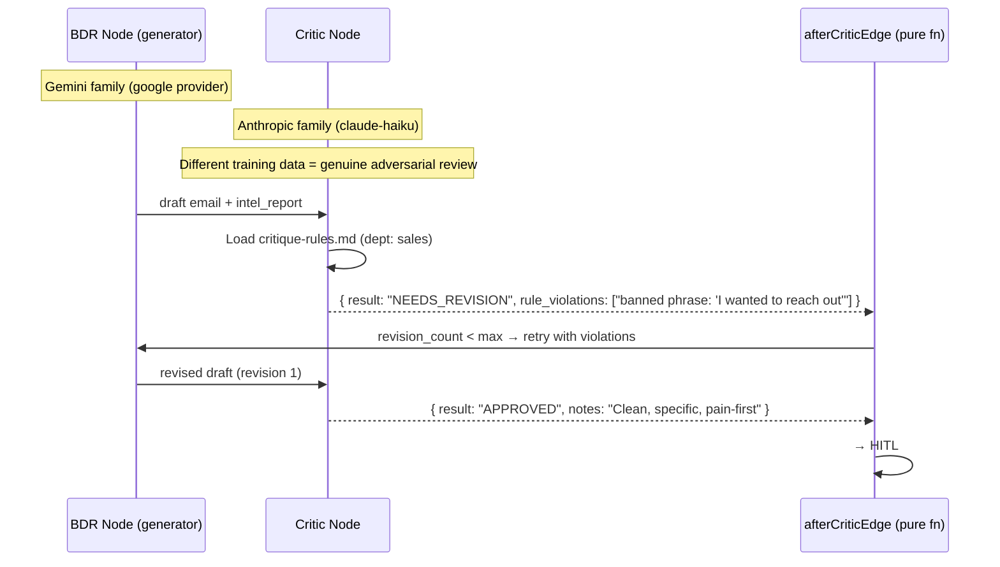
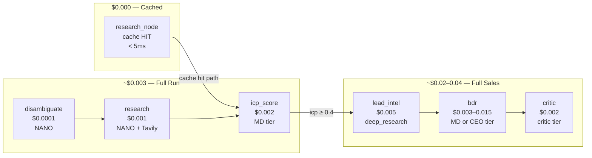

# FounderOS — Pipeline Flows

> Graph-level flows for every department pod and the full outbound prospecting pipeline.

---

## Main FounderGraph (Top Level)



---

## ProspectingPod — Outbound Lead Qualification



---

## SalesPod — Outreach Pipeline

> Updated Phase 2E: `sales_engineer_node` added between quota check and BDR.



---

## Generator-Critic Loop (Detail)



---

## Idempotency Guard (Crash Safety)

```mermaid
flowchart TD
    BEFORE["Before external action\n(email send / LinkedIn post / GitHub push)"]
    KEY["Derive idempotency_key\n= action_type:interrupt_id"]
    INSERT["INSERT action_log\n(idempotency_key)\n.onConflictDoNothing()"]
    CHECK{{"Did insert succeed?"}}>
    SKIP["Log: 'already done'\nreturn (skip action)"]
    ACT["Execute external action\n(send email via Composio)"]

    BEFORE --> KEY
    KEY --> INSERT
    INSERT --> CHECK
    CHECK -->|"no rows inserted\n(key already existed)"| SKIP
    CHECK -->|"1 row inserted\n(first time)"| ACT

    style INSERT fill:#0f3460,color:#fff
    style CHECK fill:#533483,color:#fff
    style SKIP fill:#8b0000,color:#fff
    style ACT fill:#006400,color:#fff
```

---

## Cost Flow Per Prospect


