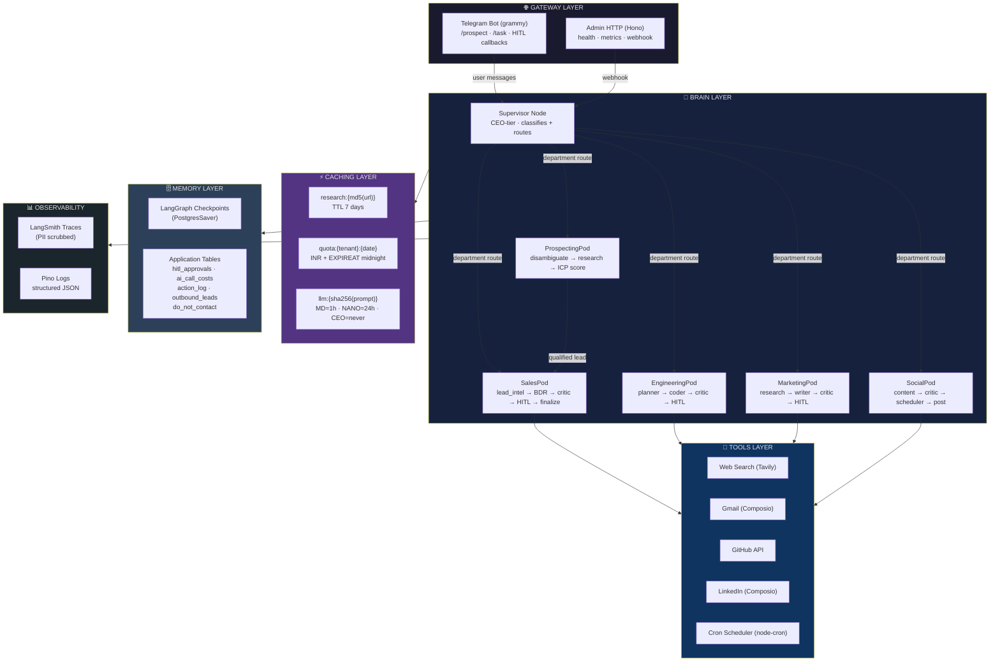
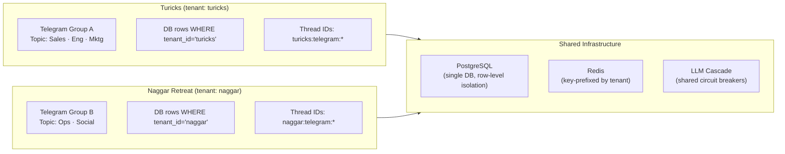
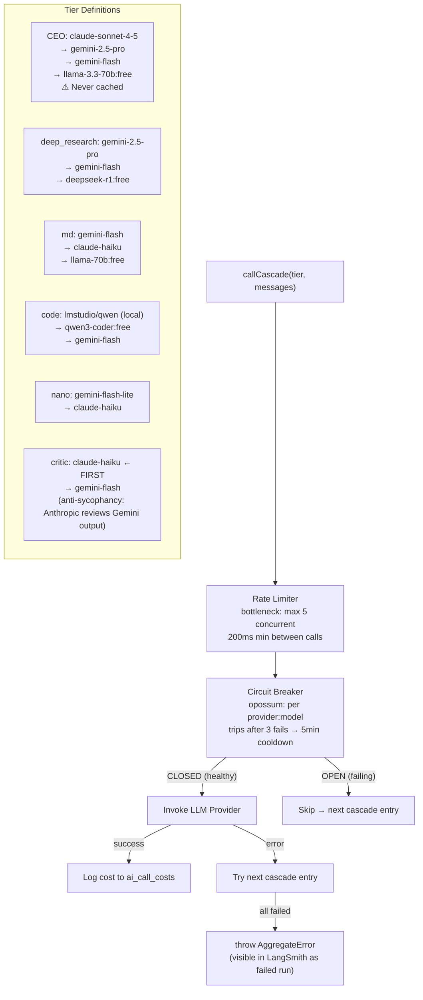
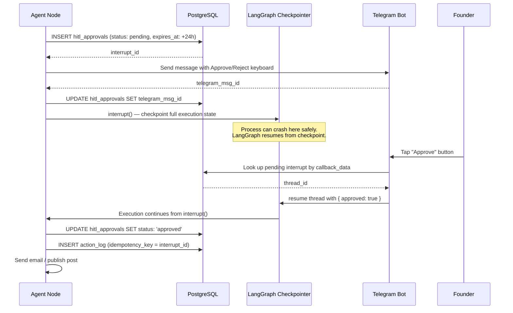

# FounderOS — System Architecture

> Mermaid diagrams of the 6-layer architecture and data flows.

---

## Layer Overview

---

## Multi-Tenant Data Isolation

---

## LLM Model Cascade

---

## HITL (Human-in-the-Loop) Durability

