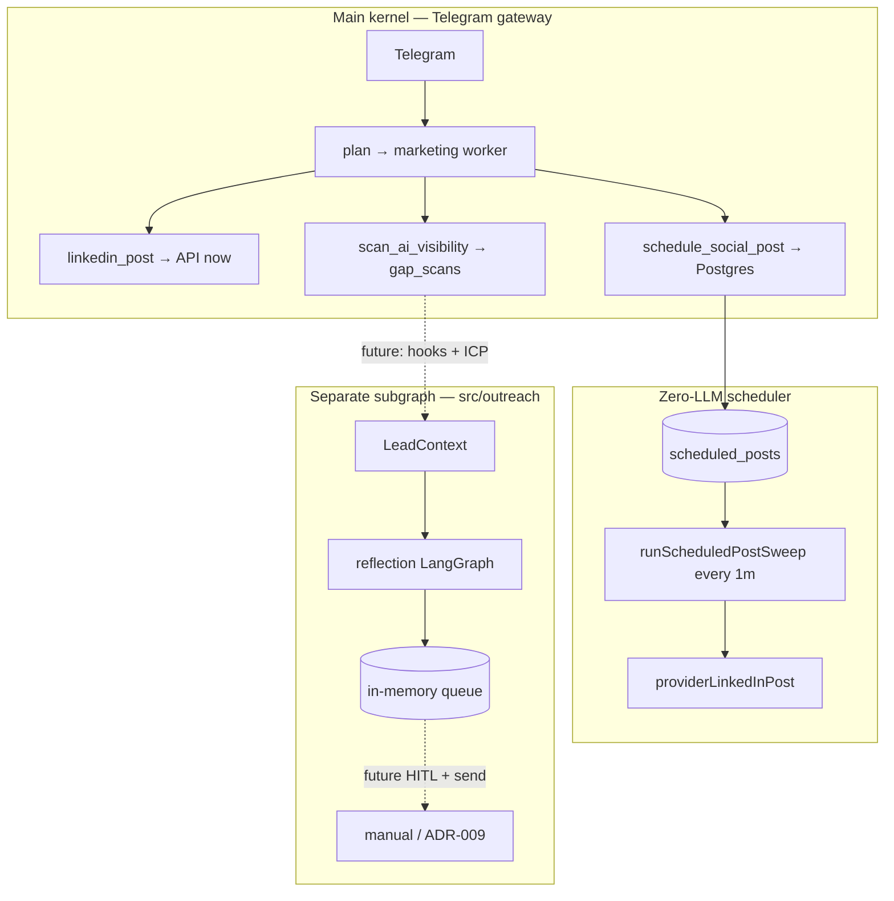

# LinkedIn & Outreach Automation — Flow Reference

**Purpose:** Single reference for every LinkedIn-related automation path in FounderOS — what each does, how it runs E2E, where the code lives, and how to verify it.

**Audience:** Founders, agents, and anyone touching marketing/sales/research code.

**Last updated:** 2026-07-11

---

## Account strategy (who posts from where)

**Full policy:** [LINKEDIN-ACCOUNT-AND-GROWTH-STRATEGY.md](LINKEDIN-ACCOUNT-AND-GROWTH-STRATEGY.md)

| Flow | LinkedIn identity | @Turicks tag | Why |
|------|-------------------|--------------|-----|
| **A. Immediate** | Turicks **company page** | No | Official brand / showcase |
| **B. Scheduled** | Pushkar **personal** | **Yes** (default) | Followers + build-in-public |
| **C. Outreach** | Personal | No | Connection notes (ADR-009) |
| **Engagement** | Turicks page context | No | Comments on company posts |

Code: `resolveLinkedInPostingPolicy()` in `src/core/linkedin-posting-policy.ts`.

Scheduled growth posts should **learn from analytics** before drafting — see growth strategy doc and `linkedin_analytics` marketing tool.

---

## At a glance — four separate systems

These are **not** one pipeline. Do not conflate them.

| Flow | What it does | Orchestration | LLM? | HITL? | Sends to LinkedIn? |
|------|----------------|---------------|------|-------|-------------------|
| **A. Immediate post** | Publish a feed post now | Main kernel → marketing worker | Yes (draft) | Yes, once | Yes, on approve |
| **B. Scheduled post** | Queue a post for future publish | Main kernel → DB queue → cron sweep | Yes (draft) | Yes, once at schedule time | Yes, at `scheduled_at` (no second approval) |
| **C. Outreach reflection** | Draft a **connection note** + queue with pacing | **Separate** LangGraph subgraph (`src/outreach/`) | Yes (generate + reflect) | **Not wired yet** | **No** — queue only (ADR-009) |
| **D. Gap scanner** | AI visibility research for prospects | Main kernel → research worker | Yes (surface calls) | No (read-only) | No |

| Flow | Production (`main`) | In flight |
|------|---------------------|-----------|
| A, B, D | ✅ Deployed | — |
| C | — | PR #310 → `beta` (`src/outreach/`) |

---

## A. Immediate LinkedIn post (`linkedin_post`)

**Use when:** Founder says *"Post this on LinkedIn now"* as **Turicks company page** (official brand).

**Not for:** Build-in-public follower growth — use Flow B (scheduled, personal + @Turicks).

### E2E path

```
Telegram message
  → kernel: plan → dispatch → marketing worker
  → (optional) search_web / search_turicks_brain
  → outboundQualityGate (brand-validator + judge)
  → hitlGate — 📋 Approve/Reject card in Telegram
  → linkedin_post tool → providerLinkedInPost (direct API)
  → action_log row + ToolReceipt
  → synthesizer reply (claims only with receipt)
```

### Key files

| Layer | Path |
|-------|------|
| Agent tool (HITL + gates) | `src/agents/agent-tools/comms.ts` → `linkedinPost` |
| Unified tool | `src/tools/linkedin.ts` |
| Provider | `src/infra/providers/linkedin-direct.ts` |
| Marketing prompts | `src/agents/prompts/marketing.ts` |
| HITL matrix | `docs/guides/HITL-MATRIX.md` |

### Env

- `LINKEDIN_ACCESS_TOKEN`, `LINKEDIN_AUTHOR_URN` — **must be Turicks org URN** for company-page posts
- `LINKEDIN_AUTHOR_URN_PERSONAL` — used by Flow B (scheduled) via `account_key: personal`
- `LINKEDIN_ORG_NAME` — display name for `@Turicks` mention on personal posts (default: `Turicks`)
- `LINKEDIN_API_VERSION` — default `202606` ([Microsoft versioning docs](https://learn.microsoft.com/en-us/linkedin/marketing/versioning?view=li-lms-2026-06))

---

## B. Scheduled LinkedIn post (`schedule_social_post`)

**Use when:** Founder says *"Schedule this for Tuesday 9am"* or cadence growth content.

**Identity:** Pushkar **personal profile** + **@Turicks** tag (default). Problem → FounderOS solution → outcome. Learns from `linkedin_analytics` on recent posts before drafting.

**On `main` only** — not on the outreach-only branch until merged.

LinkedIn has **no native schedule API** for personal posts. FounderOS stores the approved text in Postgres and a **zero-LLM cron** publishes when `scheduled_at` arrives.

### E2E path

```
Telegram message
  → kernel: plan → dispatch → marketing worker
  → worker drafts post (same brand rules as immediate post)
  → outboundQualityGate (brand + judge) — same as linkedin_post
  → hitlGate — 📅 "Schedule this LinkedIn post?" (ONE approval)
  → schedule_social_post tool → insertScheduledPost → scheduled_posts table
  → founder gets confirmation in Telegram

--- time passes (no LLM, no second approval) ---

Every minute: runScheduledPostSweep() in src/infra/scheduler.ts
  → claimDueScheduledPosts (atomic scheduled → posting)
  → providerLinkedInPost (same direct API as immediate)
  → writeAuditEntry (idempotency_key from schedule time)
  → markScheduledPostPosted
  → Telegram: ✅ Scheduled LinkedIn post published
```

### State machine (`scheduled_posts.status`)

```
scheduled → posting → posted
                 └→ failed
```

`claimDueScheduledPosts` prevents double-publish if two cron ticks overlap.

### Key files

| Layer | Path |
|-------|------|
| Agent tool (HITL + gates) | `src/agents/agent-tools/comms.ts` → `scheduleSocialPost`, `listScheduledPosts` |
| Unified tool (persist only) | `src/tools/scheduled-post.ts` |
| DB schema | `drizzle/0011_scheduled_posts.sql`, `src/db/schema.ts` |
| Queries | `src/db/queries.ts` — `insertScheduledPost`, `claimDueScheduledPosts`, `listUpcomingScheduledPosts` |
| Cron publisher | `src/infra/scheduler.ts` — `runScheduledPostSweep` (every `* * * * *`) |
| Company @tag | `src/infra/social-mention.ts`, `getCompanyPageMention()` |

### Founder commands (natural language)

| Intent | Tool invoked |
|--------|----------------|
| Schedule a post | `schedule_social_post` |
| What's queued? | `list_scheduled_posts` (read-only, no HITL) |

Default: **@tags Turicks company page** unless founder says `tag_company_page: false`.

### Env

Same LinkedIn tokens as immediate post. Scheduler runs inside the gateway process (`startScheduler()` on boot).

### Tests

- `tests/unit/tools/scheduled-post.test.ts`
- `tests/unit/infra/scheduled-post-sweep.test.ts`
- `tests/integration/scheduled-post-claim.test.ts` (real Postgres)

### Verify in prod

1. Schedule a post 2–3 minutes ahead via Telegram.
2. Approve the HITL card once.
3. Wait for cron — expect Telegram ✅ and `action_log` row with `scheduled: true`.

---

## C. Outreach reflection loop (`src/outreach/`)

**Use when:** Building **connection request notes** for sales outreach (future SaaS). **Not** the same as feed posts or scheduling.

This is a **standalone LangGraph subgraph** — it does **not** go through the main kernel planner today.

### E2E path

```
LeadContext input (profile, ICP score, personalization hooks)
  → generator node (cloud LLM — Gemini default)
  → validator node (pure code: ≤300 chars, no URLs, ICP ≥40, daily limit 20)
       ├─ pass → executor node → in-memory queue (paced scheduled_at)
       └─ fail + retries < 3 → reflector node (OpenRouter free model)
            → validator again (loop)
       └─ fail + retries ≥ 3 → fail node (typed failure_reason)

Output: OutreachRunResult { status: queued | failed, queue_entry?, draft, ... }
```

**ADR-009:** Executor **queues only**. It does **not** call LinkedIn connect API. Founder sends manually today; HITL + provider send are Phase 2.

### Model routing

| Node | Default | Override env |
|------|---------|----------------|
| Generator | `google-genai:gemini-2.5-flash` | `OUTREACH_GENERATOR_MODEL` |
| Reflector | `openrouter:meta-llama/llama-3.3-70b-instruct:free` | `OUTREACH_REFLECTOR_MODEL` |

Requires `GOOGLE_GENERATIVE_AI_API_KEY` (generator) and `OPENROUTER_API_KEY` (reflector, when validation triggers a rewrite).

### Key files

| Layer | Path |
|-------|------|
| Contracts (Zod) | `src/outreach/contracts.ts` |
| Graph | `src/outreach/graph.ts` |
| Validator (deterministic) | `src/outreach/validator.ts` |
| Models | `src/outreach/models.ts` |
| Queue (in-memory; Postgres later) | `src/outreach/queue.ts` |
| Public API | `src/outreach/index.ts` — `runOutreachReflection()` |
| Live smoke CLI | `scripts/run-outreach-reflection.ts` |

### Run / test

```bash
# Offline E2E ($0)
pnpm test tests/unit/outreach/

# Live smoke (real Gemini + OpenRouter when reflector runs)
pnpm outreach:reflect
```

### Relation to main kernel

| | Scheduled post (B) | Outreach (C) |
|--|-------------------|----------------|
| Graph | Main kernel | Separate `StateGraph` |
| Table | `scheduled_posts` (Postgres) | In-memory queue (SaaS: Postgres) |
| Content | Full feed post (150–300 words) | Connection note (≤300 **characters**) |
| Publish | Auto via cron | Not auto — queue staging only |

**Future:** Wire `runOutreachReflection()` from sales worker; feed `lead_context` from gap scanner (D).

---

## D. AI Visibility Gap Scanner (`scan_ai_visibility`)

**Use when:** Researching a prospect's AI visibility before outreach — *not* posting or connecting.

### E2E path

```
Telegram / CLI
  → research worker → scan_ai_visibility tool
  → gap-scanner surfaces (Gemini + OpenRouter) × prompt bank
  → deterministic scoring (gap-scan-core.ts)
  → Markdown report + persist to gap_scans table
  → get_gap_scans to retrieve past scans ($0)
```

Read-only — no HITL. See `src/agents/agent-tools/gap-scan.ts`, `scripts/gap-scan.ts`.

---

## What is NOT built yet

Documented plan only: `docs/plans/2026-07-11-linkedin-engagement-automation.md`

- Webhook reply engine (needs Community Management API)
- Auto-reply to comments on Company Page
- Comment-assist on watchlist posts
- Outreach queue → Postgres + dispatch worker + HITL before send

---

## Diagram — how flows coexist



---

## Adding a new LinkedIn capability — checklist

1. **Name the flow** — post, schedule, outreach, or research? (Don't mix orchestration paths.)
2. **Provider** — add to `src/infra/providers/linkedin-direct.ts` (ADR-029), never Composio in new code.
3. **Tool** — `src/tools/` UnifiedTool + `src/agents/agent-tools/` wrapper with `hitlGate` if write.
4. **Register** — `src/agents/capabilities.ts`, `HITL_GATED_TOOLS` if needed.
5. **Prompt** — `src/agents/prompts/marketing.ts` or `research.ts` workflow section.
6. **Test** — unit + integration if Postgres involved.
7. **Document** — add a section to **this file**.

---

## Related docs

- [LINKEDIN-ACCOUNT-AND-GROWTH-STRATEGY.md](LINKEDIN-ACCOUNT-AND-GROWTH-STRATEGY.md) — personal vs company page, growth formula, analytics loop
- [HITL-MATRIX.md](HITL-MATRIX.md) — gate patterns for `linkedin_post` / `schedule_social_post`
- [JUDGE-AND-CRITIC.md](JUDGE-AND-CRITIC.md) — brand + judge before outbound
- [ACCOUNT-REGISTRY-RUNBOOK.md](ACCOUNT-REGISTRY-RUNBOOK.md) — LinkedIn tokens + org URN
- [OPERATIONS.md](OPERATIONS.md) — scheduler overview
- [../plans/2026-07-11-linkedin-engagement-automation.md](../plans/2026-07-11-linkedin-engagement-automation.md) — future engagement engine
