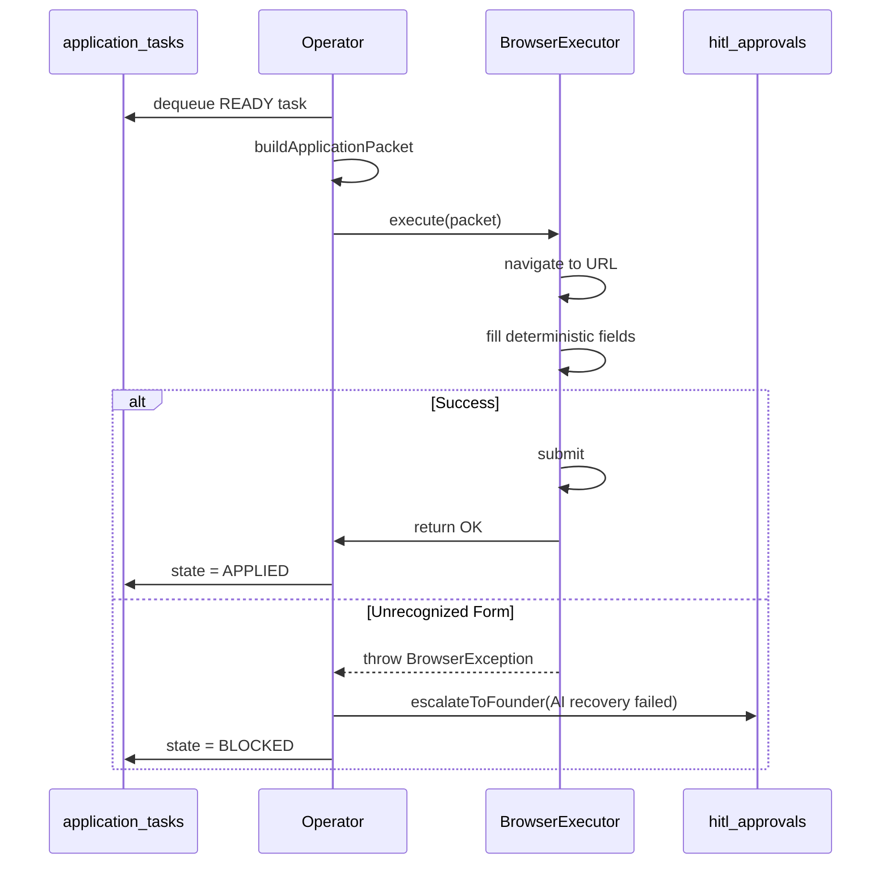

# Job Application Operator Architecture

The Autonomous Job Application Operator extends FounderOS to securely execute job applications directly on the Linux VPS using Playwright.

## 1. Domain Models

- **`job_applications`**: Represents the business state (is the candidate applied, rejected, or interviewing?).
- **`application_tasks`**: Represents the execution state (is the browser opening, filling, or submitting?).

This distinction prevents browser crashes or retry loops from polluting the top-level business tracking. 
An `application_tasks` row enforces duplicate prevention by uniquely indexing `(tenant_id, profile_id, job_id)`.

## 2. Components

1. **`JobApplicationOperator`**: The loop that polls `application_tasks` for `QUEUED`/`READY` tasks. 
2. **`buildApplicationPacket`**: Reuses existing FounderOS logic to tailor CVs and fetch profile data.
3. **`BrowserApplicationExecutor`**: Headless Playwright engine. Maps known ATS platforms (Greenhouse, Lever, Ashby, etc.) and fills fields via simulated typing.
4. **`handleBrowserException`**: The boundary for AI intervention. If the Playwright executor hits a `BrowserException` (e.g. unrecognizable form), this module kicks in to either recover using the `Antigravity` runtime or escalate to a human via `hitl_approvals`.

## 3. Sequence

