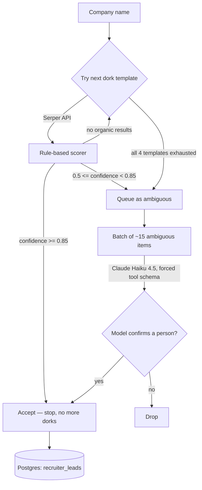

# Implementation Plan: IND Sponsor Recruiter Discovery Pipeline (Revised)

## 1. Executive Summary

This pipeline finds a real recruiter/HR contact at each company on the IND
sponsor list, for use in direct outreach alongside (not instead of) normal
ATS applications. It replaces an earlier draft that relied on direct search-
engine scraping with CAPTCHA-solving and proxy rotation to survive blocks.

The revised design routes all search traffic through **Serper**, a licensed
Google-SERP API, and resolves the vast majority of companies with **free,
deterministic rule-based parsing** of the LinkedIn URL slug and result title.
A language model (Claude Haiku 4.5) is called only for the ~10-15% of cases
the rules can't confidently resolve, batched to keep both cost and latency
low. Nothing in this design tries to detect, solve, or outlast a block —
if a source is unavailable, the pipeline tries the next deterministic
fallback or gives up on that company, rather than engineering around the
block itself.

## 2. What Changed From the Original Draft, and Why

| Original component | Status | Reason |
|---|---|---|
| CAPTCHA vision-solver (Playwright + LLM) | **Removed** | Automated circumvention of a security control a platform put there on purpose. Out of scope regardless of end goal. |
| Proxy rotation / "avoid permanent IP bans" | **Removed** | Existed only to outlast a block. Serper — a paid API with its own license to return Google results — now owns that relationship instead of us. |
| LLM rewrites query on `EMPTY` | **Replaced** | A fixed, ordered chain of four progressively looser dork templates (`dork-generator.ts`) does the same job deterministically, for free. |
| LLM extraction on every result | **Replaced** | Deterministic confidence scoring (URL slug + title + company match + keyword) resolves the large majority of cases. LLM is called only for the leftover ambiguous slice, batched ~15 at a time. |
| NLP middleware (compromise / wink-nlp) | **Dropped** | With the LLM fallback now costing well under $1 per full run (Section 7), an intermediate parsing tier buys negligible accuracy for real added complexity. |

## 3. Architecture



Two Postgres tables (Drizzle):
- `recruiter_leads` — one row per accepted contact, with `method`,
  `confidenceScore`, `evidence[]`, and `lastVerifiedAt` for future re-checks.
- `serper_query_cache` — keyed on the exact query string, so a dork is never
  paid for twice.

## 4. File Manifest

| File | Purpose |
|---|---|
| `src/tools/b2b/schema.ts` | Drizzle tables for leads and the query cache |
| `src/tools/b2b/dork-generator.ts` | Ordered, deterministic search-query fallback chain |
| `src/tools/b2b/serper-client.ts` | Serper API wrapper with caching and plain transient-error retry |
| `src/tools/b2b/rule-extractor.ts` | URL/title parsing + deterministic confidence scoring |
| `src/tools/b2b/llm-batch-extractor.ts` | Claude Haiku 4.5 batch fallback for the ambiguous slice |
| `src/tools/b2b/discovery-controller.ts` | Per-company cascade, early stopping, cross-query agreement, DB writes |
| `src/tools/b2b/runner.ts` | Bounded-concurrency batch runner over the company list |
| `src/tools/b2b/company-resolver.ts` | **Not included here** — carried over from the original Phase 1 plan (CSV → cleaned name, stripping "B.V."/"N.V."). Build or reuse before running `runner.ts`. |

## 5. Phased Plan

**Phase 1 — Foundation (0.5 day)**
- Run the `recruiter_leads` / `serper_query_cache` migrations.
- Confirm or build `company-resolver.ts` (normalizes the IND CSV into clean
  names `dork-generator.ts` expects).

**Phase 2 — Search layer (0.5 day)**
- Wire `serper-client.ts` with `SERPER_API_KEY`.
- Smoke-test `dork-generator.ts` against ~10 known companies; confirm the
  cache table is actually being hit on repeat runs.

**Phase 3 — Rule-based extraction (0.5 day)**
- Wire `rule-extractor.ts`; hand-check confidence scores against a sample
  of real Serper responses to sanity-check the weights before trusting the
  0.85 accept threshold at scale.

**Phase 4 — LLM fallback (0.5 day)**
- Wire `llm-batch-extractor.ts` with `ANTHROPIC_API_KEY`.
- Verify index alignment holds under a batch with a couple of "not a
  person" entries mixed in (job postings, news mentions).

**Phase 5 — Controller + runner (0.5 day)**
- Wire `discovery-controller.ts` and `runner.ts`.
- Run against a seed of 20-30 companies end to end before the full list.

**Phase 6 — Full run + verification (Section 8)**

## 6. Configuration & Dependencies

```
ANTHROPIC_API_KEY=...
SERPER_API_KEY=...
```

New dependencies: `@anthropic-ai/sdk`, `p-limit` (plus your existing
`drizzle-orm` setup).

## 7. Cost Model

Verified via web search, September 2026 — confirm current rates before
budgeting, both vendors reprice without much notice.

- **Serper**: ~$1 per 1,000 queries on the entry tier, down to ~$0.30 per
  1,000 at bulk volume. At ~2-3 dorks per company average across 12,000
  companies (most resolve on dork #1 due to early stopping): **roughly
  $25-36** in Serper credits for a full pass.
- **Claude Haiku 4.5**: $1/M input tokens, $5/M output tokens. Ambiguous
  slice (~1,200-1,800 companies) batched ~15 per call is roughly 100 calls
  and well under 300K tokens total: **under $1** for the entire LLM side.
- **Total for a full 12,000-company run: ~$25-36**, almost entirely Serper
  credits.

## 8. Verification Plan

- **Unit tests**: `scoreCandidate` against a fixed table of real (title,
  link, snippet) triples with known expected confidence bands — this is
  the function most worth pinning down before trusting the 0.85 threshold.
- **Integration test**: run the full cascade against 5 companies with
  manually-verified ground truth; confirm Cache → Serper → Rule-score →
  (LLM if needed) → Postgres executes and the accepted row matches.
- **Cache test**: run the same company twice; assert the second run makes
  zero new Serper calls.
- **Batch alignment test**: feed `extractAmbiguousBatch` a batch containing
  a deliberately unresolvable item; assert its index comes back correctly
  and doesn't shift the items after it.

## 9. Explicitly Out of Scope

These were deliberately removed from the original draft and should stay
removed regardless of what future accuracy or coverage pressure suggests:

- CAPTCHA detection or solving, in any form.
- Proxy rotation, IP rotation, or any mechanism whose purpose is surviving
  a block or ban.
- Direct scraping of linkedin.com, google.com, or bing.com outside of the
  licensed Serper API.
- Any "continuous background crawler" framing — this runs as a bounded,
  on-demand batch job, not a persistent stealth process.

## 10. Handoff Notes

If you're handing this to an autonomous coding agent (e.g. Google
Antigravity) rather than building it by hand: paste this plan in as the
task brief rather than letting the agent draft its own from scratch — it
already has the phase breakdown and file manifest an agent would otherwise
generate as its first artifact.

Worth pinning Section 9 specifically into whatever prompt or task
description you give the agent. An autonomous agent optimizing for "more
companies resolved" has no reason to know that CAPTCHA-solving or proxy
rotation were tried and deliberately cut — left unstated, a capable agent
with browser control may reintroduce exactly that when it hits a wall on
a hard-to-find company. Making the exclusion an explicit constraint in the
task, not just a fact in this doc, is what keeps it from being quietly
undone.
